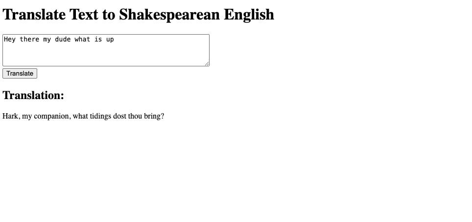
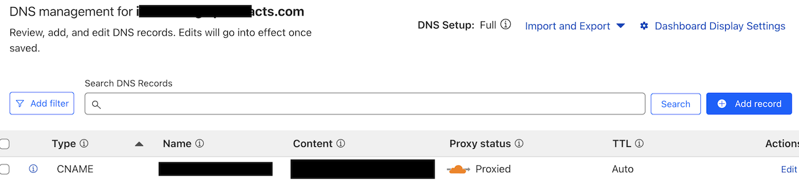

# Raspberry Pi and K3s AI

Building and Running an AI App on K3s, a Raspberry Pi and Cloudflare Tunnels

## Table of Contents
- [Overview](#overview)
- [What You Need](#what-you-need)
- [Kubernetes on Raspberry Pi](#kubernetes-on-my-raspberry-pi)
- [Building the Container](#building-the-container-a-push-the-button-to-do-something-app)
- [Kubernetes Manifests](#kubernetes)
  - [Deployment](#deployment)
  - [Service](#running-locally)
  - [Cloudflare Tunnel](#running-via-a-cloudflare-tunnel)
- [Container Registry](#storing-your-built-container-in-ecr)
- [Using the Templates](#using-the-templates)

## Overview

In an effort to learn about running applications on Kubernetes, containerization and management via pipelines I put together the following project. This set of instructions overlaps multiple domains (infra, app building, containers, Kubernetes and networking) and not all of this might be relevant to the reader. The reader might already have a cluster set up, a containerized application, wish to use a different version of Kubernetes or already have a way to grant egress/ingress to their home network (or maybe you prefer to use the cloud).

For this reason the following words are to be thought of more as a guidebook and less as a strict set of instructions (but I've basically provided instructions, nonetheless).

## What You Need 

- A functioning Kubernetes cluster (Mine runs on raspberry pi)
- A container hosted in a registry (I've included an overview of how to build one)
- OpenAI API key (for the AI functionality)

## Kubernetes on my Raspberry Pi

I have three raspberry pis configured in the following manner. One control node and two worker nodes. This is by no means a necessity, I just enjoy collecting raspberry pi's but this project could easily be done in the cloud or on an old desktop or even a laptop (or on just one pi).

I followed this guide from the k3s documentation: https://docs.k3s.io/quick-start. For the Raspberry Pi you will need to follow these directions to make some special improvements to the nodes: https://docs.k3s.io/installation/requirements?_highlight=rasp&os=pi#operating-systems

You'll use the following command:

```bash
console=serial0,115200 console=tty1 root=PARTUUID=58b06195-02 rootfstype=ext4 elevator=deadline fsck.repair=yes rootwait cgroup_memory=1 cgroup_enable=memory
```

While I found the out-of-box documentation to be sufficient I did come across this guide as well. It might be useful: https://medium.com/@stevenhoang/step-by-step-guide-installing-k3s-on-a-raspberry-pi-4-cluster-8c12243800b9


Basically, you want to make sure that you get to the point where you can run kubectl (kubectl get nodes) commands and you'll be good to go for the next step! 

### Building the Container ("a push the button to do something app")

You can either simply clone and edit my code or if you'd like to you can build it manually which might be better for learning. This "app" simply displays an input window and then has a button you can press to send whatever you input as text as a call to the OpenAI API. The response from the OpenAI API is then displayed on the screen as the output. 



### Frontend (index.html)

The `index.html` file is a template that creates a simple web interface with:
- A title you can customize
- A heading describing what the button does
- A text input area
- A submit button with customizable text
- An output area to display results

The JavaScript in this file handles:
- Capturing form submissions
- Sending the input text to your API endpoint
- Displaying the response

### Backend (app.py)

The Flask application (`app.py`) passes the submission along to the openAI API. 

### Docker Container

The dockerfile is the instruction sheet that tells the docker daemon what files to include in the container image. The easiest way to do this is to put all the container files into a single directory and run:

```bash
docker build -t what_you_want_to_name_your_image:desired_tag .
```

Here is a quick line by line of my dockerfile:

```dockerfile
FROM python:3.9-slim  # this means that my container will have a minimal debian OS and python
WORKDIR /app  # this sets this path as the working directory within the container. If you were to exec into the container you would land in this directory
COPY requirements.txt  # this ensures the requirements.txt file is copied into the local build context at /app
RUN pip install --no-cache-dir -r requirements.txt  # downloads the required files
COPY .  # copies everything else (like the static html page and the app.py file)
ENV FLASK_APP=app.py  # tells flask what the main app is
CMD ["flask", "run", "--host=0.0.0.0"]  # when someone spins up a container that uses this image it will automatically run this command making flask listen on all network interfaces
```

You might be wondering how Kubernetes is able to pass the secret (the OpenAI API key) to the running container. This is managed by the kubelet in the background, it injects the secret into the container environment before it kicks off.

### Storing Your Built Container in ECR 

This process is pretty straighforward and included here: https://docs.aws.amazon.com/AmazonECR/latest/userguide/docker-push-ecr-image.html

You'll need to make sure that you have an ECR registry set up before pushing your newly built image. If you are logged into AWS and have ECR pulled up you will see instructions for building and pushing are provided there. 

### Registry Credentials

The registry credentials template has been structured for easy customization:

```yaml
apiVersion: v1
kind: Secret
metadata:
  name: regcred  # TEMPLATE: You can rename this to match your registry
  namespace: default  # TEMPLATE: Change to your target namespace if different
type: kubernetes.io/dockerconfigjson  # Special type for Docker registry credentials
data:
  # The .dockerconfigjson value should be a base64-encoded Docker config.json file
  # You can generate this with:
  # kubectl create secret docker-registry regcred --docker-server=<your-registry-server> --docker-username=<your-name> --docker-password=<your-password> --docker-email=<your-email> --dry-run=client -o yaml
  .dockerconfigjson: <base-64-encoded-secret>  # TEMPLATE: Replace with your actual encoded credentials
```

The deployment references this secret to pull an image from your registry:

```yaml
imagePullSecrets:
- name: regcred  # TEMPLATE: Replace with your registry credentials secret name if different
```

**IMPORTANT NOTE**: ECR credentials are valid for only twelve hours.

## Kubernetes

In the folders titled deployments, services and secrets I have templates of the manifests that I created to deploy this container. This includes the node port service to run it locally and a cloudflare tunnel to expose your app to the internet should you decide that that is a good idea.

## Deployment 

A Kubernetes Deployment manages a set of pods that run a containerized application. 
```yaml
apiVersion: apps/v1
kind: Deployment
metadata:
  name: APP_NAME-deployment   # Replace APP_NAME with your application name
spec:
  # Number of identical pods to run
  replicas: 2  # Adjust based on your scaling needs
  
  # Selector defines how the Deployment finds which Pods to manage
  selector:
    matchLabels:                 
      app: APP_NAME  # Replace APP_NAME with your application name
  
  template:
    metadata:
      labels:
        app: APP_NAME  # Replace APP_NAME with your application name
    spec:
      containers:
      - name: APP_NAME-container  # Replace APP_NAME with your application name
        image: YOUR_REGISTRY/APP_NAME:TAG  # Replace with your container image
        
        # Environment variables for the container
        env:
          - name: OPENAI_API_KEY
            valueFrom:
              secretKeyRef:
                name: openai-secret
                key: OPENAI_API_KEY
        
        ports:
        - containerPort: 5000
      
      imagePullSecrets:
      - name: regcred
```

## Running locally

By deploying the application and the service and exposing it via a nodeport you can access the application by simply hitting the IP address of any of your nodes. Exposing it to the public internet will be the next challenge but let's start with the local version.

```yaml
apiVersion: v1
kind: Service
metadata:
  name: APP_NAME-service  # Replace APP_NAME with your application name
spec:
  # Service type determines how the service is exposed
  type: NodePort  # Options include ClusterIP, NodePort, LoadBalancer. For this project, stick with NodePort. 
  
  # Selector specifies which pods this service will route traffic to
  selector:
    app: APP_NAME  # Replace APP_NAME with your application name (must match deployment labels so that Kubernetes service routes to the correct workloads)
  
  # Port configuration
  ports:
    - protocol: TCP  # The network protocol (usually TCP)
      port: 80       # Port exposed by the service
      targetPort: 5000  # Port your application listens on in the container
      nodePort: 30000   # External port (only for NodePort type, 30000-32767 range)
                        # Not necessary if you are using a Cloudflare tunnel
```

Replace `APP_NAME` with your application name.

## Exposing via a Cloudflare tunnel

I wanted to expose my application to the internet but was nervous about it for obvious reasons. I was also not very keen on messing around with my home network to set up a DMZ vlan, port-forward, etc...

### Cloudflare to the rescue!

By following these directions: https://developers.cloudflare.com/cloudflare-one/tutorials/many-cfd-one-tunnel/ cloudflare will basically set up a deployment that runs pods that will proxy traffic to your service -- you don't need to change the example service above but you can remove the nodePort since it's not necessary anymore. The other big advantage to using a cloudflare tunnel is that it makes it very easy to host your project via a domain name.

```yaml
config.yaml: |
    # Name of the tunnel you want to run
    tunnel: TUNNEL_ID_HERE  # TEMPLATE: Replace with your tunnel ID from Cloudflare
    credentials-file: /etc/cloudflared/creds/credentials.json
    
    # Serves the metrics server under /metrics and the readiness server under /ready
    metrics: 0.0.0.0:2000
    
    # Autoupdates applied in a k8s pod will be lost when the pod is removed or restarted, so
    # autoupdate doesn't make sense in Kubernetes. However, outside of Kubernetes, we strongly
    # recommend using autoupdate.
    no-autoupdate: true
    
    ingress:
    # The first rule proxies traffic to your application service
    - hostname: YOUR_DOMAIN_HERE  # TEMPLATE: Replace with your domain (e.g., app.example.com)
      service: http://APP_NAME-service:80  # TEMPLATE: Replace APP_NAME with your service name
```

To summarize, you first need to define the parameters in the ingress block so that traffic is routed properly internally. From there, run the command 'cloudflared tunnel route dns <tunnel> <hostname>' to tell cloudflare to route the tunnel to the domain you own. On the Cloudflare side you will need to set up a DNS CNAME record that points from your domain to the tunnel ID. 



From here you should be able to hit your domain and see your webpage! Pretty cool! 


## Using the Templates

Here is a quick summery of how to use the manifests I provided as a basic template. 

1. **Frontend (index.html)**:
   - Change the title, headings, and button text
   - Update the configuration variables at the top of the script

2. **Backend (app.py)**:
   - Modify the configuration section at the top
   - Update the prompt template to change what OpenAI does with the input

3. **Kubernetes Manifests**:
   - Replace `APP_NAME` with your application name in all files
   - Update image references to point to your container
   - Adjust resource limits and other settings as needed

4. **Cloudflare Tunnel**:
   - Update with your tunnel ID and domain
   - Ensure the service name matches your application service
